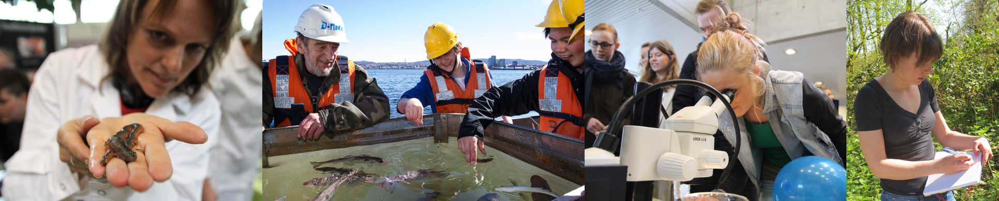

Understanding the complexity of nature requires the collection and analysis of data. From the earliest days of study, biologists have observed nature, conducted experiments, and measured things. All of these processes create data. In order to make sense of this data, biologists need quantitative skills.

*Figure 1: Photos of three types of biological data collection. (Sources (left to right): Emily G. Simmonds, NTNU Faculty of Natural Sciences)*

With the continuing improvements in technology, biologists are getting more efficient at collecting data. We now collect more data, on more topics, than ever before. As a result, quantitative skills are becoming more and more important for biologists. A modern biologist needs to acquire skills for the collection, organisation, analysis, and interpretation of data.

Quantitative biological studies lead to new and exciting findings (see the examples at the bottom of the page).

The field of biology is increasingly dedicated to working with data in clever and innovative ways.

 
 
 

# Quantitative methods in modern biology
