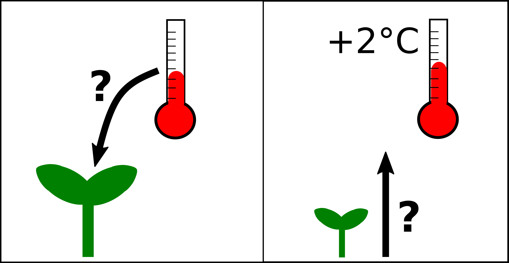

```{r setup 1, include=FALSE, echo=F}
library(tidyverse)
library(png)
library(ggimage)
DiveData <- read_csv("DiveDepths.csv", col_names=T)
DiveData <- DiveData %>% mutate(MaxDepth = as.integer(MaxDepth), Species = 
                                  as.factor(Species), Group = as.factor(Group))
InsectData <- read_csv("ButterflyData.csv", col_names=T)
```

# Before you start {.facta}

You should be familiar with basic statistical theory, basics of R, continuous and 
categorical data, hypothesis
testing, statistical modelling, and linear models.

## Introduction

In this section, we will look at how we can use simple linear regression to analyse data with a continuous numeric response and a numeric explanatory variable. Linear regression is a type of linear model.

</br>

Linear regression has two motivations. The first is called **inference**. This is when you want to say something about a population from a sample. The second is **prediction**, where we use models to predict values of the response for specified values of the explanatory variable. These predictions can either be for observed values of the explanatory (mainly for plotting), for unobserved values of the explanatory variable within the same range as observations, or for novel values of the explanatory variable outside the range of observations (this is more risky! - more on this later). 

</br>
 
**Example inference question:** 

does the height of plants increase with increasing temperatures?
 
**Example prediction question:** 

how tall will a plant be if mean temperatures increase by 2&deg;C?



</br>

</br>
 
In simple terms, we fit a straight line to:

1) estimate a relationship between $X$ and $Y$

2) predict change in $Y$ from change in $X$. 
 
Linear regression assumes a causal relationship between $X$ and $Y$, i.e. it assumes that $X$ does  something to $Y$. However, we can never actually test this, we can only quantify the patterns. To test if $X$ really does have a causal affect on $Y$, you would need experiments. It is our job when analysing data, to decide whether we can assume causality or not. For some examples of when causality is not a sensible assumption [click here](https://www.tylervigen.com/spurious-correlations).

```{r, include = T, echo = F, warning = F}
Spurious <- read_csv("Spurious.csv", col_names = T)

ggplot(Spurious, aes(y=UraniumUS, x=MathsPHD))+
  geom_point()+
  geom_smooth(method="lm")+
  ylab("Uranium stored in US (million pounds)")+ 
  xlab("Number maths PhDs awarded")+
  theme_minimal()
```
*Figure X: Scatterplot of number of maths PhDs awarded in a year against the amount of uranium stored in US power plants annually. Smooth line indicates a regression line for this data with the 95% confidence interval as the shaded area.*

</br>

## <i class="far fa-question-circle"></i> Which questions? 
 
Example questions you can answer with linear regression:
 
 * How does temperature change with time?
 * How does the amount of crime change with temperature?
 * How does relative plant biomass change with light intensity?
 * What will the temperature be in 2100?
 * How tall will someone be if they have hair 30cm long?
 
</br>

## <i class="fas fa-table"></i> Type of data {.tabset .tabset-fade}

</br>

### Theory

A linear regression is used when you have continuous numeric response variable and a continuous numeric explanatory variables. A **simple linear regression** has only one explanatory variable, a **multiple linear regression** has more than one. There is no upper limit in theory, but if you add too many, your model will be less complex than reality.

**Examples of continuous numeric variables**:

* Temperature
* Rainfall
* Distance
* Height
* Weight

</br>

**Always remember to check that the way your variables are classified in R is the same 
format you expect.** It is a common mistake for a variable that should be numeric
to be classified as a Factor, or a Factor as a character string etc.  

You can check the way R has classified your variables using the Environment panel,
printing the object by typing its name in the R console, or using the `str()` 
function.

If the classification R has given the variables doesn't match what you expect, you
can change the classification using functions such as: `as.numeric()`, `as.factor()`,
or `as.integer()`. These `as.` functions exist for every data type. 

</br>

```{r, include = F, echo = F}
set.seed(2020)
ExampleData <- as_tibble(data.frame(x = round(rnorm(100,seq(1,100,1),10),2),
                          y = seq(1,50,length.out=100),
                          z = seq(1,100,1)))
```

```{r, include = T, echo = T}
ExampleData
```

</br>

### Worked example

For this worked example we will be using some data on dive depths of
marine mammals.


*Figure X: Illustration of marine mammals by Emily G. Simmonds.*

</br>

#### Introduction to the data

These data have four variables; species, maximum recorded dive depth in metres, 
body weight in kilograms, and taxonomic group. 

The data were collected from a variety of sources and cover several taxonomic 
groups (including
polar bear, sea otters, baleen whales, toothed whales, seals, sea lions).

<details><summary> Full list of data sources</summary>

Sources: 

* http://www.bbc.co.uk/earth/story/20150115-extreme-divers-defy-explanation
* https://www.researchgate.net/figure/Maximum-depth-and-duration-of-dive-tagged-blue-whales_tbl1_11900120
* http://whitelab.biology.dal.ca/rwb/humpback.htm
* https://books.google.co.uk/books?id=-dXAcVFhkuQC&pg=PA33&lpg=PA33&dq=max+recorded+humpback+dive&source=bl&ots=mJvyxA4e3S&sig=ACfU3U3ZFOnypZ0Rvej3VpK11Fpci-UfAg&hl=en&sa=X&ved=2ahUKEwiHgq3enNbpAhXFSxUIHfCTD9MQ6AEwDnoECAkQAQ#v=onepage&q=max%20recorded%20humpback%20dive&f=false
* https://www.npolar.no/en/species/walrus/
* https://onlinelibrary.wiley.com/doi/abs/10.1111/j.1748-7692.2005.tb01228.x
* https://teara.govt.nz/en/diagram/6175/ocean-dive-depths
* https://www.researchgate.net/publication/260209989_Advances_in_non-lethal_research_on_Antarctic_minke_whales_biotelemetry_photo-identification_and_biopsy_sampling
* https://www.dolphincommunicationproject.org/index.php/the-latest-buzz/field-reports/bahamas-3/bahamas-2000/item/93037-how-deep-can-dolphins-dive
* https://books.google.no/books?id=2rkHQpToi9sC&pg=PA325&lpg=PA325&dq=max+recorded+common+dolphin+dive&source=bl&ots=hFnuNx8dwr&sig=ACfU3U0Og9623-SPJkxROGsodqDcuEeDNQ&hl=en&sa=X&ved=2ahUKEwizoOnNodbpAhWyxaYKHW9hAHMQ6AEwDHoECAkQAQ#v=onepage&q=max%20recorded%20common%20dolphin%20dive&f=false
* https://polarbearscience.com/2018/10/15/scientific-study-finds-polar-bears-excel-at-diving-contradicting-previous-expert-opinion/
* https://books.google.no/books?id=kkRKJCofvXMC&pg=PA445&lpg=PA445&dq=max+recorded+sea+otter+dive&source=bl&ots=HX_ypXO6zq&sig=ACfU3U1ugMJRJtd21NLfrpDVirSmCx15kA&hl=en&sa=X&ved=2ahUKEwjo29WxotbpAhUGy6YKHQzmDHMQ6AEwAHoECAsQAQ#v=onepage&q=max%20recorded%20sea%20otter%20dive&f=false
* https://nammco.no/marinemammals/
* https://www.fisheries.noaa.gov/species/
* https://www.doc.govt.nz/nature/native-animals/marine-mammals/--->
</details>

</br>

You can find the data [here]() if you want to follow along with this example. 
It is a `.csv` file with column headings. 

The first thing we want to do with the data once it is imported is to look at it. 
We will do this by looking at the raw data and making a plot.

```{r, include = T, echo = T}
DiveData

ggplot(DiveData, aes(x=BodySizeKG, y=MaxDepth, color=Group))+
  geom_point()+
  theme_minimal()

# load the picture and add
#marinemammals <- readPNG("MarineMammals.png")
#rasterImage(marinemammals,80,0,105,25)
```
*Figure X: Scatterplot of body size against maximum dive depth for marine mammals. Colours indicate taxonomic group.*

This gives some idea of what our data look like. We can see that two of our
variables are factors (Species and Group). One of our variables is clearly
continuous numeric (MaxDepth) and one is integer (BodySizeKG). From our knowledge
of the characteristics of body size, we know that this actually is continuous
even though the scientists who measured it have rounded to make it integer. Therefore,
we will change this to be numeric to ensure R treats it the right way in our
analyses.

```{r, include = T, echo = T}
DiveData <- mutate(DiveData, BodySizeKG = as.numeric(BodySizeKG))
```

In this example, we are interested in **whether body size (kg) influences maximum 
dive depth (m) in marine mammals.** To answer this question we will need the variables:
`BodySizeKG` and `MaxDepth`. We will not need `Species` or `Group` for now, but
we might need them later. 

</br>

Now we have familiarised ourselves with our data, know what question we 
want to ask, and which variables we need to use, **we are ready to start an
analysis.** 


</br>

## <i class="fas fa-project-diagram"></i> Model details {.tabset .tabset-fade}


</br>

### Theory

When we create a model we want to represent mathematically how the data were generated. 

When we use a regression model (this is also true for linear models) make an assumption that there is a linear relationship between our two variables. Mathematically, we say that we can capture the data generation process with a straight line and some error.
 
The line is defined by two parameters: <span style="color:orange">**$\alpha$**</span> = the intercept, where the line crosses the y-axis and <span style="color:blue">**$\beta$**</span> = the slope of the line (steepness/gradient), it is how much $Y$ changes for every increase in 1 unit of $X$. We can alter the position of the line using these two parameters. The final part of the model is <span style="color:red">**$\epsilon$**</span>, which is the error around the line, we estimate this using a parameter **$\sigma^{2}$** that is the variance of the error. 
 
We can write these model components as and equation in terms of $Y$:

$$
Y_i = \color{orange}\alpha + \color{blue}\beta X_i + \color{red}\epsilon_i
$$

#### Assumptions

There are several assumptions that we make when using a linear regression model:

* The relationship between X and Y is linear
* Residuals (error) are normally distributed 
* The residuals have a mean of 0
* The variance of the residuals is equal for all fitted values (homoscedasticity)
* There are no outliers
* Each value of Y is independent

</br>

All of these assumptions should be met for the model to work properly. We check
five of them after we have fit the model. The independence of Y should be 
determined during data collection. Data should be collected in a way that ensures
each Y is independent of the others. 

</br>
</br>

#### Writing the model in <i class="fab fa-r-project"></i>
</br>

To fit the simple linear regression in <i class="fab fa-r-project"></i> 
we will use the `lm()` function.

`lm()` stands for linear model (should seem familiar). It takes several arguments:

* formula in form: `y~x`
* data: your data object

The function will fit the regression model using maximum likelihood estimation and give us
the maximum likelihood estimates of <span style="color:orange">$\alpha$</span> and <span style="color:blue">$\beta$</span> as an output. It does also estimate $\sigma^{2}$ of the error, but it does not report this.

</br>

To use the `lm()` function you first need to think about the formula argument, 
the `y~x` part. The same way as in the equation above, the letter $Y$ always 
corresponds to the response variable (the thing we are trying to explain) and 
$X$ to an explanatory variable (the thing we assume affects the response). 

Therefore, to write the formula for the `lm()` function, you need to know which
variable is your response and which is your explanatory. You can work this out by
thinking about what question you want to ask with your model e.g.

</br>
**Does temperature influence wing length of butterflies?**


*Figure X: Cartoon illusration of the Colias hecla butterfly by Emily G Simmonds.*

```{r, include = T, echo = T}
InsectDataF <- InsectData %>% filter(sex == "f") %>% group_by(year) %>%
                              summarise(AvWingLength = mean(winglength), 
                                        Temp = mean(temp)) %>%
                              ungroup()

ggplot(InsectDataF, aes(x = Temp, y = AvWingLength))+
  geom_point()+
  ylab("Mean wing length in mm")+
  xlab("Temperature for May/June (ºC)")+
  theme_minimal()
```
*Figure X: Scatterplot of the butterfly wing length data.*

For this example we use some data on *Colias hecla*, the northern clouded yellow butterfly. These data were taken from the paper: High-Arctic butterflies become smaller with rising temperatures by
Joseph J. Bowden, Anne Eskildsen, Rikke R. Hansen, Kent Olsen, Carolyn M. Kurle and Toke T. Høye *Biology Letters* Volume 11, Issue 10
Published:01 October 2015 [doi:10.1098/rspb.2013.0174] (https://doi.org/10.1098/rsbl.2015.0574). The data are freely
available [here](https://datadryad.org/stash/dataset/doi:10.5061/dryad.43gt3). The researchers measured the wing length of the butterflies to the nearest 0.01 mm. They measured many individuals over many years. In this example we will use data from only the females and take the mean wing length for each year. The measure of temperature is the average temperature from May and June in ºC. 
</br>

Then you can see your explanatory ($Y$) = temperature, it is the variable that
does the influencing.The response ($X$) = wing length, it is the result. 

We can then plug these variables into the `lm()` function in the below format using
the column names in place of `y` and `x` and including our data frame name as the
data argument. 

</br>
```{r, include = T, echo =T}
InsectModel <- lm(AvWingLength ~ Temp, data = InsectDataF)
```

<details><summary>I saw an `lm()` written differently, what's that about?</summary>

You can use the `lm()` function without the data argument. If you do this, you
need to refer to your ($X$) and ($Y$) variables in the `y~x` formula using a `$`
between the data name and the column name. 

**We do not recommend using this approach.** There are several reasons for this
but a key one is that when using the `$` syntax, R sees the variable name as the
whole entry `DiveData$MaxDepth` rather than as the column name `MaxDepth`. This 
makes it difficult to use this model for other things e.g. to predict.

```{r, include = T, echo = T}
InsectModel_alt <- lm(InsectDataF$AvWingLength ~ InsectDataF$Temp)
```

</details>
</br>

You can then look at the results using the function `coef()`. This takes the 
output of `lm()`, the model object, as its argument and extracts the maximum
likelihood estimates of <span style="color:orange">$\alpha$</span> and <span style="color:blue">$\beta$</span>.

```{r, include = T, echo =T}
coef(InsectModel)
```

</br>

### Worked example 

</br>

This worked example demonstrates how to fit a linear regression model in <i class="fab fa-r-project"></i> using the `lm()` function for the dive depths example.

In this example we are asking:

**Does body size influence maximum dive depth in marine mammals?**

Our question is formulated to suggest a direction of causality, we assume body
size has a causal effect on maximum dive depth, therefore maximum depth is our 
response ($Y$) and body size as our explanatory variable ($X$). 

We can put these variables into the `lm()` function in the below format. 

```{r, include = T, echo =T}
DiveModel <- lm(MaxDepth ~ BodySizeKG, data = DiveData)
```

</br>

Great. We have run a model and assigned it to an object name. 

We can look at the maximum likelihood estimates of our model parameters 
(<span style="color:orange">$\alpha$</span> and <span style="color:blue">$\beta$</span>) using the function `coef()`.

```{r, include = T, echo =T}
coef(DiveModel)
```

We will look at interpreting these in the next part of the worked example. 

## <i class="fas fa-laptop"></i> Parameters {.tabset .tabset-fade}

</br>

### Theory
</br>

We introduced the three model parameters of a simple linear regression in the section
above: <span style="color:orange">**$\alpha$**</span> = the intercept, <span style="color:blue">**$\beta$**</span> = the slope of the line (steepness/gradient), and <span style="color:red">**$\sigma^{2}$**</span> the variance of the error. 

</br>
**But what do these parameters really mean?**
</br>

All regression analyses are fundamentally about using straight lines to represent
the relationship between a response ($Y$) and some explanatory variables ($X$), called
a **regression line**. 
The parameters of the model determine the placement and gradient of the straight
line, as well as representing the distribution of data points around the line. 

</br>
```{r, echo = F}
ggplot(ExampleData, aes(x=x, y=y))+
  geom_point(color = "grey")+
  geom_line(aes(y=y, x=z), color = "blue", size = 2)+
  theme_void()
```
</br>
*Figure X: Illustration of a straight line and data.*

We will illustrate the meaning of parameters continuing with the insect example 
from the previous section.

In this section we will go through each parameter we estimate in a simple
linear regression and what it means in terms of the relationship between $X$ and $Y$.
</br>
</br>

#### <span style="color:orange">$\alpha$</span>, the intercept

This first parameter gives the value of $Y$ when $X$ = 0, it is the point that
the straight line crossed the y-axis. 

In the figure below, the intercept is highlighted. 

```{r, include = T, echo =T}
ggplot(InsectDataF, aes(x=Temp, y=AvWingLength))+
  geom_point(colour = 'grey70')+
  geom_abline(intercept = coef(InsectModel)[1], slope = coef(InsectModel)[2])+
  geom_point(aes(x=0, y=coef(InsectModel)[1]), colour = 'orange', size = 3)+
  ylab("Mean wing length in mm")+
  xlab("Temperature for May/June (ºC)")+
  ylim(21,24)+
  theme_minimal()
```
*Figure X: Plot of regression line and data.*

</br>
If you want to find the maximum likelihood estimate of <span style="color:orange">$\alpha$</span> from your `lm()`
object you can use the `coef()` function as we did in the previous section. The
<span style="color:orange">$\alpha$</span> value is the one labelled `(Intercept)`, 22.93 in the example below. 

```{r, include = T, echo =T}
coef(InsectModel)
```

</br>
</br>

#### <span style="color:blue">$\beta$</span>, the slope

This second parameter gives the amount of change in $Y$ for every change of 1 in $X$, it is
the gradient of the regression line. 

In the figure below, the intercept is highlighted. 

```{r, include = T, echo =T}
ggplot(InsectDataF, aes(x=Temp, y=AvWingLength))+
  geom_point(colour = 'grey70')+
  geom_abline(intercept = coef(InsectModel)[1], slope = coef(InsectModel)[2],
              colour = 'blue', size = 2)+
  ylab("Mean wing length in mm")+
  xlab("Temperature for May/June (ºC)")+
  ylim(21,24)+
  theme_minimal()
```
*Figure X: Plot of regression line and data.*
</br>

If you want to find the maximum likelihood estimate of <span style="color:blue">$\beta$</span> from your `lm()`
object you can use the `coef()` function as we did in the previous section. The
$\beta$ value is the one labelled by the variable name (`x` here), -0.11 in the example below.

```{r, include = T, echo =T}
coef(InsectModel)
```

</br>
</br>

**Together $\alpha$ and $\beta$ control the position of the regression line.** They are called the **systematic** part of the model, the bit that links $Y$ to the covariate $X$. You
will notice that we use them to plot the line on our graph using `geom_abline()`.
Changing the intercept shifts how high up on the y-axis the line sits and changing 
the slope alters the steepness (gradient). But it is important to note that these
two parameters are not independent. 
</br>

**The regression line must always pass through the point that represents the
mean of $X$ and the mean of $Y$. ($\bar{X}$, $\bar{Y}$).** Therefore, if you change
the intercept, the slope must change as well to keep the line going through the
($\bar{X}$, $\bar{Y}$) point. You can have a go at doing this below. 

</br>
```{r}

knitr::include_app("https://shiny.math.ntnu.no/qmbio/Shiny_apps/Regression/")

```
</br>
</br>

#### $\sigma^{2}$, the variance of error
 
This is the final parameter we need to estimate for the simple regression and it is
a bit different from <span style="color:orange">$\alpha$</span> and <span style="color:blue">$\beta$</span>. This parameter does not relate directly 
to the shape or position of the regression line, instead, this parameter captures
the variance of the data points around that line. This can be called the **random** part of the model, the error. In the case of a simple linear regression, the error is a normally distributed.

As you can see in the figures above, although we have plotted our fitted line, it
is not capturing all of the variation in data. We can see that not all of the data
points are sitting on the regression line. 

The value of $Y$ for each $X$ at the 
regression line is called a **fitted value**. The distance between the fitted values
and the values of $Y$ that were actually observed are called **residuals**. You
can extract the residuals from your model object using the function `residuals()`.

```{r, include = T, echo =T}
InsectPredictions <- predict(InsectModel, type="response")
InsectResiduals <- resid(InsectModel)
highlight <- tibble(x=c(-0.509, -0.509), prediction = c(22.98737, 23.69016))
```
</br>

```{r, include = T, echo =T}
residuals <- residuals(InsectModel)

ggplot(InsectDataF, aes(x=Temp, y=AvWingLength))+
  geom_point(colour = 'grey70')+
  geom_line(aes(y=InsectPredictions))+
  geom_segment(aes(xend=Temp, yend=InsectPredictions), colour = 'red')+
  geom_point(aes(x=-0.509, y= 22.98737), colour = 'purple')+
  geom_point(aes(x=-0.509, y= 23.69016), colour = 'purple')+
  geom_line(data=highlight, aes(x=x, y=prediction), colour='purple')+
  ylab("Mean wing length in mm")+
  xlab("Temperature for May/June (ºC)")+
  ylim(21,24)+
  theme_minimal()
```
*Figure X: Plot of regression line with residuals highlighted.*
</br>

The residual is the difference between the observed point and the predicted/fitted point. Therefore, when a data point is below the regression line, the residual will be negative. Above the line the residuals will be positive. E.g. for the fitted value for $X$ = -0.5 
is 22.9, the residual = 0.70 (highlighted in purple on the graph above).

</br>

#### Interpreting the parameters
</br>

Now we know what each of the three parameters in a simple linear regression
mean, we can now think about interpreting them. 

**Which of the three parameters do you think is most important for answering
our research question "Does temperature influence body size of insects?"?**

</br>

<details><summary>I had a go, now show me the answer.</summary></span>

**The slope ($\beta$).** This is because the gradient or slope of the regression
line is what tells us how strong and in what direction the relationship between $X$
and $Y$ is. While we need to estimate the intercept of the line and the residual
variance, these do not directly tell us about the relationship of interest.

To predict, we need all of the parameters. 

</details>

</br>

### Worked example 
</br>

In the previous section of this worked example, we fit a simple linear 
regression using the `lm()` function and looked at the estimates of 
some parameters using the `coef()` function. In this section, we will use model theory to interpret what those parameters mean.

#### The intercept and slope

We already know that the parameters of the intercept and slope control the position
and gradient of the regression line. It is the estimates of these two parameters that we get from the `coef()` function. 

</br>

For our dive depths model the estimates are:

```{r, include = T, echo =T}
coef(DiveModel)
```

</br>

The intercept is 756 m and the slope of the relationship between body size and dive depth is -0.005. 

In this case, the intercept is not that interesting. It tells us the expected value of $Y$ (maximum dive depth) when $X$ (body size) = 0. It does not make a lot of biological sense to know the expected dive depth of a marine mammal that weighs 0 kg. 

The slope on the other hand is interesting. It tells us the direction and strength of the relationship between body size and maximum dive depth. In this case our model estimates that for every increase of 1 kg in body size, marine mammals will have a maximum dive depth that is 0.005 m less deep. In other words, as the slope is negative, we can see this is a negative relationship and as $X$ increases $Y$ decreases.

</br>

#### Residual variance

The `coef()` function can give us the maximum likelihood estimates of the intercept and slope parameters, but it hasn't given any information on the final parameter $\sigma^{2}$. To get an estimator of this parameter, we need to use the `residuals()` function to extract the residuals from our model and the `var()` function to calculate the variance of our model residuals.

```{r, include = T, echo =T}
DiveResiduals <- residuals(DiveModel)
sigma2 <- var(DiveResiduals)
sigma2
```

For this model the $\sigma^{2}$ = 508212. This number is not very interesting to us in terms of answering whether body size influences dive depth. But we will use it for prediction later. 

</br>
</br>

#### Plotting the results

As well as looking at the maximum likelihood estimates of the parameters from the simple linear regression, we can also plot the results. 

To do this, we will use `ggplot()` with `geom_line()`. We will also need to use a new function called `predict()`. 

To make this first plot, we only need to use two arguments: 

* `object` = your model object
* `type` = "response", which means predict on the response scale


```{r, include = T, echo =T}
DepthPredictions <- predict(DiveModel, type="response")
```

</br>

Once we have created predictions of $Y$ from the model object, we can then plot these using `geom_line()` as in the code below. 

```{r, include = T, echo =T}
ggplot(DiveData, aes(x=BodySizeKG, y=MaxDepth))+
  geom_point(colour = 'grey70')+
  geom_line(aes(y=DepthPredictions))+
  ylab("Maximum Dive Depth (m)")+
  xlab("Body Size (kg)")+
  theme_minimal()
```
*Figure X: Scatter plot of dive depths against body size. Line is the regression line from a linear model.*
</br>

In the next section we will look at how to add uncertainty to these plots and our interpretation. 

</br>

## <i class="fas fa-arrows-alt-h"></i> Quantify uncertainty {.tabset .tabset-fade}

</br>

### Theory
</br>
You should already know that statistics does not give a single correct answer. When we estimate the values of parameters in our statistical model, there are many different values that could plausibly have produced our observed data. Some of these are more likely than others but others will have very similar likelihoods. 

A simple linear regression is no different. We still need to consider and present the uncertainty in the parameters we estimate. 

The `lm()` function uses maximum likelihood estimation for parameter estimation.
Therefore, our consideration of uncertainty for these models follows the same
principles as discussed [here](link to ML page). We will quantify uncertainty using
**standard errors**, **confidence intervals**, and **prediction intervals** which should be familiar to you
but head to the [uncertainty]() pages if you need a recap.

</br>

For any regression there are two different types of uncertainty we will look at
**uncertainty in our line parameters $\alpha$ and $\beta$** and **uncertainty in a
prediction of $Y$**.

#### Uncertainty in the estimates of $\alpha$ and $\beta$

##### Standard error

**The standard error of a parameter is the standard deviation of its sampling distribution. It gives a measure of the spread of the sampling distribution i.e. our uncertainty.** To find the standard errors for the estimates of $\alpha$ and $\beta$ we can use
the `summary()` function. The argument that `summary()` takes is a model object, the
output from `lm()`. This function gives a big table with lots of information.
The first line shows the model formula used for the model object. The second line shows
a summary of the residuals of the model and the
standard errors are shown as the second column in the third part, `Coefficients:`.

```{r, include = T, echo =T}
summary(InsectModel)
```
</br>

If we take the `summary()` of the InsectModel, we can see the standard error or the 
intercept ($\alpha$) is 0.1396, and the standard error for the slope ($\beta$) is 
0.0945. 

For both parameters, the standard error is smaller than the estimated effect. **But, how
small is small enough?**

</br>

##### Confidence intervals

For interpretation of the uncertainty, it can be easier to use the standard error
to calculate confidence intervals. Confidence intervals indicate the range of plausible values for a parameter. **They represent an interval, that if you were to collect a sample and run the
analysis, then
repeat that many many times AND each time
draw a confidence interval, on average 95% of the time, the true population value of the parameter would be found in within the confidence interval.** 

</br>

To calculate a confidence interval from a standard error you need to use the formulas:

$$
\begin{aligned}
UpperCI = estimate + (1.96 SE) \\
LowerCI = estimate - (1.96 SE) \\
\end{aligned}
$$
1.96 is used because in a standard normal distribution 95% of the distribution lies 
within 1.96 standard deviations of the mean. In this case the distribution is the sampling 
distribution, which is normal for $\alpha$ and $\beta$ and the standard deviation is the standard error. 

</br>

Using the formulas above, we can get confidence intervals for the intercept and
slope from the InsectModel.

</br>

<details><summary> I had a go at calculating, what is the correct answer?</summary>

```{r, include = T, echo =T}
# INTERCEPT

# Upper confidence interval
UpperCI_intercept <- 22.9337 + (1.96*0.1396)
# Lower confidence interval
LowerCI_intercept <- 22.9337 - (1.96*0.1396)

# Print the interval
c(UpperCI_intercept, LowerCI_intercept) 

# SLOPE

# Upper confidence interval
UpperCI_slope <- -0.1054 + (1.96*0.0945)
# Lower confidence interval
LowerCI_slope <- -0.1054 - (1.96*0.0945)

# Print the interval
c(UpperCI_slope, LowerCI_slope) 
```

</details>

</br>

It is also possible to get R to calculate the confidence intervals for you. To do this
you can use the `confint()` function. The argument is a model object. 

```{r, include = T, echo =T}
confint(InsectModel)
```

</br>

Hopefully these confidence intervals look the same as those you calculated yourself. 

</br>

##### Plotting uncertainty

</br>

We have seen how you can quantify uncertainty in our line parameters into numbers. But often in science, it is clearer to show these things visually. 

We can add the confidence intervals to Figure X showing our regression line. 

To do this, we need to generate new predictions with the `predict()` function. This time, we need to add the argument `interval = "confidence"`. The `interval` argument tells R to
include predictions of $Y$ based on the upper and lower confidence intervals of the estimates of $\alpha$ and $\beta$. We can then add these to the plot using `geom_ribbon()`

```{r, echo = T, warning = F}
InsectPredictions <- predict(InsectModel, type="response", interval = "confidence")

# turn the predictions into a tibble
# and add the x values

InsectPredictions <- InsectPredictions %>% as_tibble(InsectPredictions) %>%
                      mutate(x=InsectDataF$Temp)

ggplot()+
  geom_ribbon(data=InsectPredictions, aes(x=x, ymin=lwr, ymax=upr), fill='grey50')+
  geom_point(data=InsectDataF, aes(x=Temp, y=AvWingLength), colour = 'grey70')+
  geom_abline(intercept = coef(InsectModel)[1], slope = coef(InsectModel)[2],
              colour = 'blue', size = 1)+
  ylab("Mean wing length in mm")+
  xlab("Temperature for May/June (ºC)")+
  ylim(21,24)+
  xlim(-2.9, 0.4)+
  theme_minimal()
```
*Figure X: Plot of regression line and confidence interval for the insect data.*
</br>

You will notice that the confidence interval is narrower in the middle and wider at the ends. This is partly to do with the constraint that the regression line must go through the ($\bar{X}$, $\bar{Y}$) point so the intercept and slope are not independent. Therefore, the confidence interval will be narrowest close to that point. 

</br>

#### Uncertainty in a prediction of $Y$

So far, we have looked at uncertainty in parameter estimates using standard errors and confidence intervals but linear regression analyses can also be used for prediction. 

When we use a regression for prediction it has uncertainty. 
Uncertainty in relationship is captured by confidence intervals.
Prediction uncertainty captured by **prediction intervals**. 
A prediction interval gives a range of values that can be considered likely to contain
a future observation.

For prediction we need to convey uncertainty in estimated relationship and scatter around the line (error).

So, prediction error includes the variance of the residuals too ($\sigma^2$ is finally useful!). Therefore, prediction intervals are always wider than confidence intervals.

</br>

While confidence intervals are used to represent uncertainty in parameters
and to relate them to an underlying population, prediction intervals are used to represent
uncertainty in predictions. It gives a plausible range for the next observation of the response
(i.e. for the
new value of Y). It is a type of confidence interval, but in regression it will be wider than the
confidence interval of the line (which includes uncertainty in our parameters $\alpha$ and 
$\beta$). **A 95% prediction interval tells you, if you were to collect a sample and run the
analysis, then
go out an collect a new observation of the response variable ($Y$)
with particular value of the explanatory variable ($X$) many many times AND each time
draw a prediction interval, 95% of the time, the new observation
would fall in within the prediction interval.** 

</br>

To find the prediction interval for a prediction you need to change the `interval` argument in the `predict()` function to `="prediction"`. The below example predicts the wing length for a temperate of 10\ºC.

```{r, echo = T, warning = F}
predict(InsectModel, newdata=data.frame(Temp=10), 
                             type="response", interval = "prediction")
```

</br>

The predicted wing length is 21.9mm with a prediction interval of 19.5mm to 24.3mm.

</br>

### Worked example 

At the end of the last section, we created a plot of our dive depth data and the estimated linear regression line. Now, we will add uncertainty to that plot. 

First, we should look at the confidence intervals of our parameter estimates.

```{r, include = T, echo =T}
round(confint(DiveModel),2)
```
</br>

The confidence intervals have been rounded to 2 decimal places to make them easier to read. The intercept interval spans from approx 450 to 1060. The slope interval crosses 0, going from -0.02 to +0.01. 

</br>

To add these intervals to the plot, we need to make new predictions including the interval. 

```{r, include = T, echo =T}
DepthPredictions <- as_tibble(predict(DiveModel, type="response", interval="confidence"))
```

</br>

Once we have created predictions of $Y$ from the model object, we can then plot these using `geom_line()` as in the code below. 

```{r, include = T, echo =T}
DepthPredictions <- DepthPredictions %>% as_tibble(DepthPredictions) %>%
                      mutate(x=DiveData$BodySizeKG)

ggplot()+
  geom_ribbon(data=DepthPredictions, aes(x=x, ymin=lwr, ymax=upr), fill='grey50')+
  geom_point(data=DiveData, aes(x=BodySizeKG, y=MaxDepth),colour = 'grey70')+
  geom_line(data=DepthPredictions, aes(y=fit, x=x))+
  ylab("Maximum Dive Depth (m)")+
  xlab("Body Size (kg)")+
  theme_minimal()
```
*Figure X: Scatter plot of dive depths against body size. Line is the regression line from a linear model. Shaded area is 95% confidence interval*

</br>

The plot shows that the uncertainty in the estimated relationship gets increasingly uncertain as you get to higher body sizes. 

</br>

#### Predicting dive depths for a body size of 75000kg

A colleague as just found a new species of whale (fictional). The whale washed up on shore in Tromsø, it weighed 75000kg. Based on our linear regression analysis, how deep would we expect it to dive?

```{r, echo = T, warning = F}
predict(DiveModel, newdata=data.frame(BodySizeKG=75000), 
                             type="response", interval = "prediction")
```
</br>

The mean prediction is 352m deep. This seems ok. But when we look at the prediction interval, we see that when we include uncertainty, we are not even sure if they whale will dive below the surface by 2km or jump into the air by 1.3km. When we include uncertainty, it is clear that based on the current data and model, we cannot say anything about the possible dive depth of the new whale. We even get biologically unrealistic predictions. 

This is something we will look at in the next section.

</br>

## <i class="fas fa-tasks"></i> Model checking {.tabset .tabset-fade}

We have now have a model, estimates of parameters, and uncertainty. **But how do we know if this model is any good?** 
</br>

### Theory

To find out if our model is any good from a theoretical perspective, we need to consider whether it meets the assumptions of the linear regression that are stated in the **Model details** section above. 

To do this, we use graphs called **diagnostic plots**, which can be easily made in R. Each plot tests whether a different assumption has been met. There are three key diagnostic plots that we use for simple linear regression.

</br>

#### Residuals vs fitted plot

This plot tests the assumptions of **The relationship between X and Y is linear**, **The residuals have a mean of 0**, and **The variance of the residuals is equal for all fitted values (homoscedasticity)**. 


* The relationship between X and Y is linear
* Residuals (error) are normally distributed 
* The residuals have a mean of 0
* The variance of the residuals is equal for all fitted values (homoscedasticity)
* There are no outliers
* Each value of Y is independent
</br>

### Worked example 

How to create diagnostic plots in R and some interpretation and fixing examples e.g. log() and sqrt().

</br>

## <i class="far fa-lightbulb"></i> Draw conclusions {.tabset .tabset-fade}

### Theory


The confidence intervals show that the estimate of the intercept has low uncertainty relative to the estimate size and is clearly different to 0. But it is the slope we are really interested in for drawing conclusions. The uncertainty for the slope is much larger relative to the mean estimate. In this case, the confidence interval spans 0. In other words, 0 sits between the upper and lower interval because they are different signs (positive and negative). This means that 0 is included in the plausible range of 
What each parameter can mean for a result and how to word statistical conclusions. 

Also include R squared here. 

</br>

### Worked example 

How to read outputs from R and plot results. 

</br>

# What's next? {.facta}

* **Linear models for categorical explanatory variables**/**ANOVA** for analyses when your explanatory variable is not numeric.
* **Multiple regression** for analyses with more than one numeric explanatory variable.
* **Generalised linear models** for analyses when your response variable is not normally distributed.

